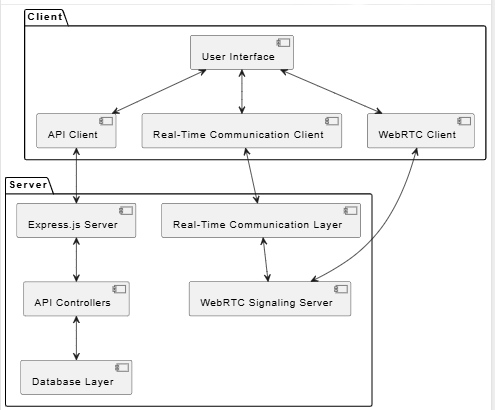

# ✍️ Talksy

Talksy is a full-stack application that allows you to send and/ receive instant
message, audio and video calls.

## Motivation 
While platforms like Zoom, Google Meet, and many of the more feature-rich communication apps on the market have undoubtedly revolutionized the way we communicate in the digital age, navigating the various menus, settings, and customization options often proved to be a frustrating and time-consuming experience, especially for **less tech-savvy users**. 

I recognized that the true power of communication technology lies in its ability to empower and connect people, not to overwhelm them with unnecessary complexity. This realization inspired me to take a radically different approach with Talksy: create a platform that would prioritize simplicity and intuitiveness above all else, empowering everyone to communicate effectively with minimal effort.

## 💻⚛️🏗️🛠️ Tech-stacks used

- [Node.js](https://nodejs.org/en)
- [EJS](https://ejs.co/)
- [MongoDB](https://www.mongodb.com/)
- [Socket.io](https://socket.io/)
- [Bootstrap5](https://getbootstrap.com/)
- [Cloudinary](https://cloudinary.com/) (cloud storage for profile pictures and media files)
- No third-party packages used for audio and video call, but a browser navigator.

## Main Features

- Register and login/logout
- Settings
- One to one or group chat/call
- Create group and add members to it
- Invite friends, colleagues, or anyone else who uses the app
- search for contacts
- Contact list
- Remove contacts
- Send files (Audio, video, image)
- View online users
- Read and unread new messages from users
- pages Authentication
- Dark and light mode support
- Browser notifications with sound for new message
- On/Off notification sound
- Send, copy, forward, and delete Message
- Search for messages or chats
- clear chats
- Take pictures through webcam
- Update personal profile including profile picture
- Send Emojis
- Authentication using google ReCaptcha
- Resopnsive on all devices

## Getting Started & Installation

### prerequisite

Your hosting server:

1. Must support Node.js and have SSH access.
2. SSL (Secure Sockets Layer) must be installed.

## Installation

1. Install [Node](https://nodejs.org/en/) and npm
2. Fork the project
3. open the project in your favorite code editor
4. Navigate to the `Talksy` directory, then run the following command to install dependencies👇:

   ```bash
   npm install
   ```

5. Configure your MongoDB database. After configuring you will find a Mongo URI — put that in your `config.env` file as `DATABASE_LOCAL`.

6. Set up Cloudinary for media/file uploads:
   - Sign up at [cloudinary.com](https://cloudinary.com) (free tier is enough)
   - Go to your **Dashboard** and copy your credentials
   - Add them to `config.env`:
     ```env
     CLOUDINARY_CLOUD_NAME=your_cloud_name
     CLOUDINARY_API_KEY=your_api_key
     CLOUDINARY_API_SECRET=your_api_secret
     ```

7. Add all required environment variables to your `config.env`:
   ```env
   DATABASE_LOCAL=your_mongodb_uri
   PORT=3000
   CAPTCHA_SITEKEY=your_recaptcha_v2_site_key
   CAPTCHA_SECRET=your_recaptcha_v2_secret_key
   CLOUDINARY_CLOUD_NAME=your_cloud_name
   CLOUDINARY_API_KEY=your_api_key
   CLOUDINARY_API_SECRET=your_api_secret
   JWT_SECRET=your_jwt_secret
   JWT_EXPIRES_IN=90d
   JWT_COOKIE_EXPIRES_IN=90
   ```
   > **Note:** For reCAPTCHA, make sure you create a **v2 "I'm not a robot" Checkbox** key at [google.com/recaptcha/admin](https://www.google.com/recaptcha/admin) and add `localhost` to the allowed domains.

8. Once you successfully connect with MongoDB and configure `config.env`, run:
   ```bash
   npm run dev
   ```
   This will start the **Talksy** app on http://localhost:3000

## Architecture


<br>

## Issues

If you find any issues while installing or using the app, kindly open an [issue](https://github.com/ali-hamza-jutt/Talksy/issues) with the tag "enhancement".

**Note:** Make sure you browse through the existing issues to check if the issue already exists.<br>

## How to use Talksy

1. To use Talksy, you have to create an account first. Then, to send a message to or chat with someone, the person(s) you would like to communicate over the Talksy app must have a Talksy acount too.
2. Once you are done with step one, then navigate to `Contacts` from the left center of the app and search for the person you want to chat or call.

## Contribution

Any contributions you make are **greatly appreciated**.

If you have a suggestion that would make this app better, please fork the repo and
create a pull request. You can also simply open a [discussions](https://github.com/ali-hamza-jutt/Talksy/discussions/) or an [issue](https://github.com/ali-hamza-jutt/Talksy/issues) with the tag "enhancement".

#### Please give this repo a ⭐ if you found it helpful and share it with your friends.

## Developer

Built with ❤️ by [Ali Hamza](https://alihamzajutt.vercel.app)
